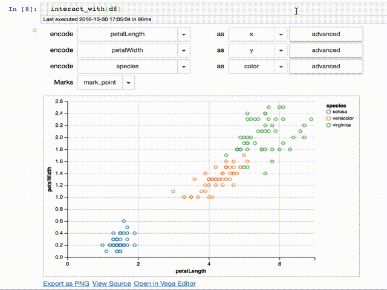
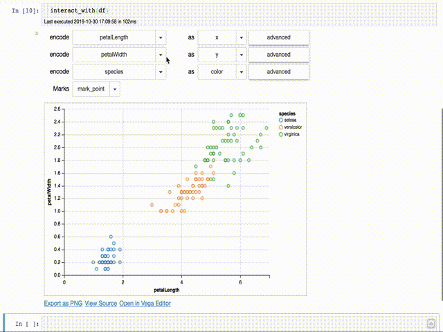

# Altair Widgets

Altair Widgets are a tool to easily allow to interact with Altair charts in the
Jupyter notebook.

This tool allows interactive exploration:

## Related work
* UW-Data is also working on [Voyager], and have an alpha [online demo] that can
  be used with any data.
* [modrian-rest-ui] is a similar tool implemented in Javascript that also
  depends on the same framework Altair depends on, [vega-lite].

[vega-lite]:https://vega.github.io
[modrian-rest-ui]:https://github.com/jazzido/mondrian-rest-ui
[Voyager]:https://github.com/vega/voyager
[online demo]:https://uwdata.github.io/voyager2/
